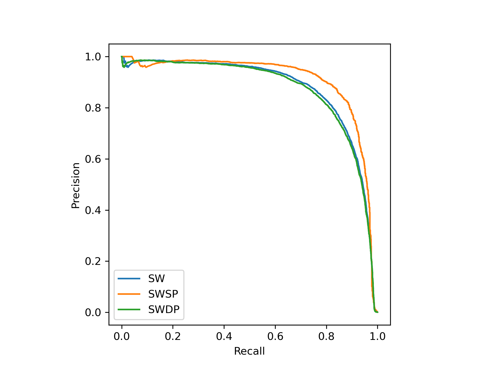

# LibriSpeech Same-Different Word Discrimination Task

A tool to evaluate framewise speech features for word discrimination. To construct the task, we followed the method from [Rapid evaluation of speech representations for spoken term discovery](https://www.isca-speech.org/archive/interspeech_2011/carlin11_interspeech.html). The task can be performed with dynamic time warping on 2D continuous features or with edit distance on 1D discrete units.

The word features are extracted from the LibriSpeech dataset after aligning with [Montreal Forced Aligner](https://montreal-forced-aligner.readthedocs.io/). The alignments used can be found [here](https://github.com/nicolvisser/librispeech-samediff/releases/tag/v0.1).

The words included in the evaluation are selected with the following criteria:

- 5 or more characters
- 0.5 seconds or more duration
- at least 2 occurrences in the subset

Summary of the selected words:

| Subset     | Word Count | Word Pairs | SWSP\* | SWDP\* | DWSP\*  | DWDP\*     |
| ---------- | ---------- | ---------- | ------ | ------ | ------- | ---------- |
| dev-clean  | 4,167      | 8,679,861  | 1,300  | 6,044  | 231,469 | 8,441,048  |
| dev-other  | 3,261      | 5,315,430  | 2,071  | 4,416  | 191,897 | 5,117,046  |
| test-clean | 4,910      | 12,051,595 | 1,689  | 6,895  | 319,360 | 11,723,651 |
| test-other | 3,561      | 6,338,580  | 1,615  | 4,422  | 216,799 | 6,115,744  |
| dev        | 7,428      | 27,583,878 | 3,371  | 18,642 | 423,366 | 27,138,499 |
| test       | 8,471      | 35,874,685 | 3,304  | 20,455 | 536,159 | 35,314,767 |

<sup><sub>
*SWSP = Same Word Same sPeaker<br>
*SWDP = Same Word Different sPeaker<br>
*DWSP = Different Word Same sPeaker<br>
*DWDP = Different Word Different sPeaker
</sub></sup>

## Installation

Ensure you have a working Python environment with `dtaidistance` installed.

```bash
conda create -n libri-sd -c conda-forge dtaidistance
```

```bash
conda activate libri-sd
```

To check if the `dtaidistance` library is built with C support, run the following command:

```bash
python -c "from dtaidistance import dtw; print(dtw.try_import_c(verbose=True))"
```

If not, check [installation and troubleshooting](https://dtaidistance.readthedocs.io/en/latest/usage/installation.html).

Install the tool from the root directory

```bash
pip install .
```

## Usage

### Data preparation

Ensure you have a directory containing a numpy file for each utterance in the evaluation set. The numpy files should have the same stems as the audio files in LibriSpeech, e.g. `1272-128104-0000.npy`. The tool will recursively search for a file in the directory.

1. For continuous features

Each numpy file should contain a 2D array of shape `(T, D)` where `T` is the number of frames and `D` is the number of features per frame. The features should be properly aligned with the audio such that `T*feature_rate ≈ audio_duration`.

2. For discrete units

Each numpy file should contain a 1D array of shape `(T,)` where `T` is the number of frames. The units should be properly aligned with the audio such that `T*feature_rate ≈ audio_duration`.

### Running the tool

From a terminal with the environment activated, run

```bash
samediff-dtw
```

to evaluate continuous features, or

```bash
samediff-ed
```
to evaluate discrete units.

Then follow the prompts.

Alternatively, specify the options:

```
Usage: samediff-dtw [OPTIONS]

Options:
  --subset [dev-clean|dev-other|dev|test-clean|test-other|test]
                                  The LibriSpeech subset to use  [required]
  --feature-dir DIRECTORY         Directory containing the features
                                  [required]
  --feature-rate FLOAT            How many features per second  [required]
  --log-dir DIRECTORY             Directory to save logs results to
                                  [required]
  --run-name TEXT                 Name of subdirectory to save logs results
                                  to. If not specified, will use current
                                  timestamp
  --block-size INTEGER            Size of blocks for DTW distance computation.
                                  Smaller blocks reduce memory usage and show
                                  more frequent progress updates.
  --help                          Show this message and exit.
```

```
Usage: samediff-ed [OPTIONS]

Options:
  --subset [dev-clean|dev-other|dev|test-clean|test-other|test]
                                  The LibriSpeech subset to use  [required]
  --units-dir DIRECTORY           Directory containing the 1D unit IDs
                                  [required]
  --unit-rate FLOAT               How many units per second  [required]
  --log-dir DIRECTORY             Directory to save logs results to
                                  [required]
  --run-name TEXT                 Name of subdirectory to save logs results
                                  to. If not specified, will use current
                                  timestamp
  --num-processes INTEGER         Number of processes to use for parallel
                                  computation of chunks
  --chunk-size INTEGER            Number of sequential pairs to process in
                                  each chunk
  --help                          Show this message and exit.
```

The tool will output several files in {log_dir}/{run-name}. These include average precision (AP) and precision-recall breakpoint (PRB) in the three cases: SW, SWSP, SWDP. It also plots and saves the prevision-recall curve.

## Example Results

We evaluate the HuBERT Soft features (256D features before the cosine similarity computation) from this [repo](https://github.com/bshall/hubert) and [paper](https://ieeexplore.ieee.org/abstract/document/9746484) on the dev-clean set.

```
Average Precision:
SW:     0.8776
SWSP:   0.9088
SWDP:   0.8710

Precision Recall Break-Even Point:
SW:     0.8136
SWSP:   0.8538
SWDP:   0.8066
```


